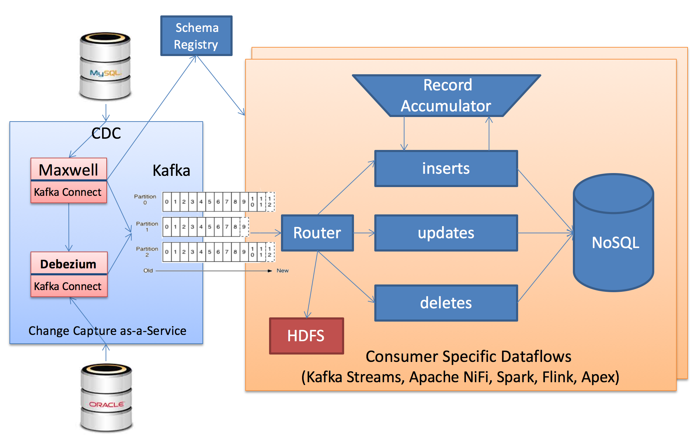

CDC Hadoop Dataflow
===================
A low latency, multi-tenant *Change Data Capture(CDC)* pipeline to continuously replicate data from **OLTP(**MySQL**)** to **OLAP(**NoSQL**)** systems with no impact to the source.


> This project demonstrate how to build dataflow pipeline to move data from O]operational databases(MySQL, Oracle) to analytics databases(Hadoop, MongoDB, MarkLogic) in real-time using **Change Data Capture(CDC)**, **Kafka** and tools like **Apache NiFi**, **Kafka Streams** or **Spark** to process and ingest data into Hadoop.



### Features

1. Capture changes from many Data Sources and types.
2. Feed data to many client types (real-time, slow/catch-up, full bootstrap).
3. Multi-tenant: can contain data from many different databases, support multiple consumers.
4. Non-intrusive architecture for change capture.
5. Both batch and near real time delivery.
6. Isolate fast consumers from slow consumers.
7. Isolate sources from consumers
    1. Schema changes
    2. Physical layout changes
    3. Speed mismatch
8. Change filtering
    1. Filtering of database changes at the database level, schema level, table level, and row/column level.
9. Buffer change records in **Kafka** for flexible consumption from an arbitrary time point in the change stream including full bootstrap capability of the entire data.
9. Guaranteed in-commit-order and at-least-once delivery with high availability (`at least once` vs. `exactly once`)
10. Resilience and Recoverability
12. Schema-awareness

### Setup

#### Install and Run MySQL
Install source MySQL database and configure it with row based replication as per [instructions](./storage/mysql/).

#### Install and Run Kafka
Follow the [instructions](./storage/kafka/)

#### Install and Run Maxwell

```bash
cd cdc/maxwell
curl -L -0 https://github.com/zendesk/maxwell/releases/download/v1.0.0/maxwell-1.0.0.tar.gz | tar --strip-components=1 -zx -C .
```

### Run

   `cd cdc/maxwell`

1. Run with stdout producer (for testing only)

   `bin/maxwell --user='maxwell' --password='XXXXXX' --host='127.0.0.1' --producer=stdout`
2. Run with kafka producer

   `bin/maxwell`

### Test

#### Manual Testing
If all goes well you'll see maxwell replaying your inserts:

```sql
mysql -u root -p

mysql> CREATE TABLE test.shop
       (
         id BIGINT(20) NOT NULL AUTO_INCREMENT,
         version BIGINT(20) NOT NULL,
         name VARCHAR(255) NOT NULL,
         owner VARCHAR(255) NOT NULL,
         phone_number VARCHAR(255) NOT NULL,
         primary key (id, name)
       );
mysql> INSERT INTO test.shop (version, name, owner, phone_number) values (0, 'aaa', 'bbb', '3331114444');
Query OK, 1 row affected (0.02 sec)

(maxwell)
{"database":"test","table":"shop","pk.id":4,"pk.name":"aaa"}
{"database":"test","table":"shop","type":"insert","ts":1458510224,"xid":33531,"commit":true,"data":{"owner":"bbb","name":"aaa","phone_number":"3331114444","id":4,"version":0}}
```

####  Testing via Grails App
You can also use [testApp](./testApp/) to generate load.


### Reference
1. [Maxwell's Daemon](http://maxwells-daemon.io/quickstart/)
2. [LinkedIn: Creating A Low Latency Change Data Capture System With Databus](http://highscalability.com/blog/2012/3/19/linkedin-creating-a-low-latency-change-data-capture-system-w.html)
3. [Introducing Maxwell, a mysql-to-kafka binlog processor](https://developer.zendesk.com/blog/introducing-maxwell-a-mysql-to-kafka-binlog-processor)
4. [Martin Kleppman's blog: Using logs to build a solid data infrastructure](https://martin.kleppmann.com/2015/05/27/logs-for-data-infrastructure.html)
5. [Bottled Water: Real-time integration of PostgreSQL and Kafka](http://www.confluent.io/blog/bottled-water-real-time-integration-of-postgresql-and-kafka/)
